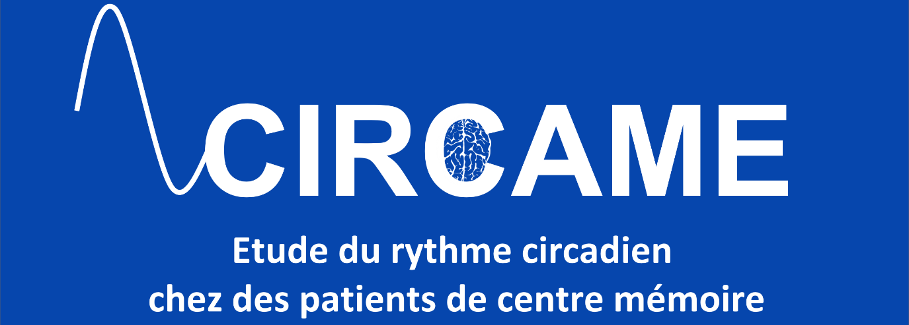

+++
archetype = "page"
title = "Study presentation"
weight = 2
+++

Circadian rhythm (CR) regulates body functions over the 24-hour day/night period; sleep/wake cycle is its most visible manifestation. The objective of **CIRCAME** is to identify circadian rhythm disturbances specific to Alzheimer’s disease and related disorders. 

A wrist-worn device, accelerometer worn over a period of 9 days, will be used to measure components of the circadian rhythm such as physical activity, sleep, chronotype (being a morning or evening person), or fragmentation of the sleep/wake cycle. 
The importance of circadian rhythm for Alzheimer’s disease and related dementias will be compared to other individual factors, such as: 
- lifestyle (household composition, tobacco consumption, etc.), 
- clinical measurements (blood pressure, weight, etc.), 
- biological measurements (cerebrospinal fluid biomarkers, plasma biomarkers, etc.), 
- health-related measures (medication, diseases, etc.).

**The overarching aim of the CIRCAME study is to identify circadian rhythm signatures that along with individual characteristics (clinical, biomarkers, etc.) could be used to facilitate early screening of Alzheimer’s disease and related disorders, and provide an indication on progression of disease.** 

This study is recruiting patients from two Parisian clinical establishments of the “Assistance Publique - Hôpitaux de Paris” (APHP):
- [the Cognitive Neurology Center at Fernand-Widal – Lariboisière hospital](https://centre-memoire.aphp.fr/)
- [the Geriatric Day Hospital at Bretonneau hospital](https://www.hopital.fr/annuaire-service/hopital-de-jour-geriatrique-ap-hp-hopital-bretonneau-paris,39472)

For patients seen at the Cognitive Neurology Centre at Fernand Widal Hospital, a sub-study called **CIRCAME-EYE** will also be proposed. It consists of an examination of the retina in the form of photographs of the eye including a refractometry measurement, a fundus photo, and an OCT/OCT-A (optical coherence tomography/angiography). None of these measurements required the administration of eye drops. 
**The aim of the CIRCAME-EYE sub-study is to examine whether microvascular dysfunction and the level of degeneration in the eye could be a marker of neurocognitive health.**
