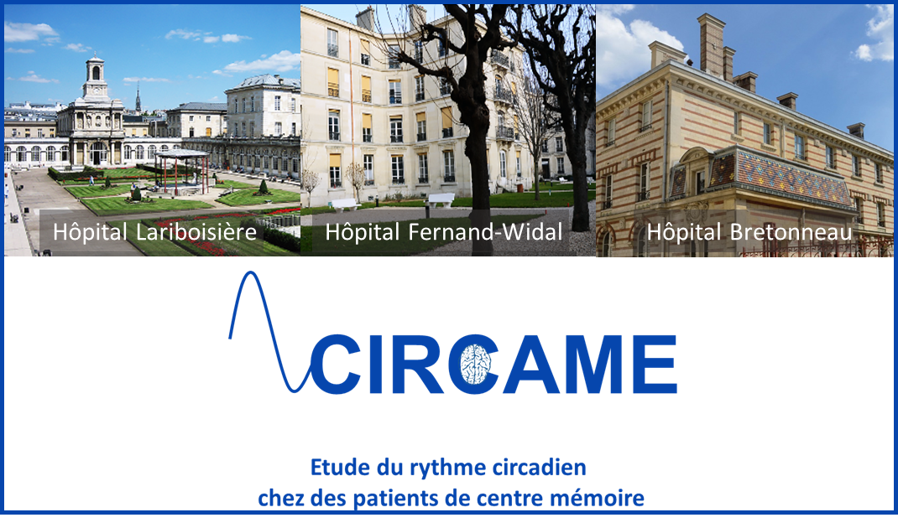

+++
archetype = "home"
weight = 1
+++

The **CIRCAME** study aims to investigate disturbances of the sleep/wake cycle, a marker of the circadian rhythm, in patients seen at two medical establishments from Paris hospitals (APHP), the Cognitive Neurology Center of the Lariboisière, Fernand Widal Hospital, and the Geriatric Day Hospital of the Bretonneau Hospital. 

**CIRCAME** is funded by the European Union and the primary aim is to examine whether an accelerometer-based measure (a wrist-worn device) of circadian rhythm can distinguish patterns specific to Alzheimer’s disease and related disorders. Identification of specific circadian rhythm “signatures” could facilitate early screening of these diseases. 

**CIRCAME** also includes measures of lifestyle, clinical, biological, and health measures to provide a complete clinical profile of participants of the study.

# News

{}
Bienvenido a todos.
{}

{}
Beware of pickpockets. 
{}