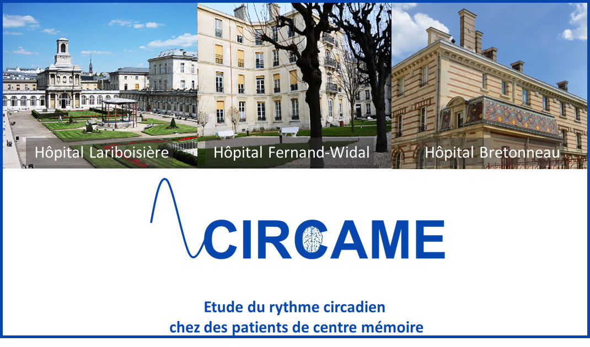

+++
archetype = "home"
weight = 1
+++

L'étude **CIRCAME** s'intéresse aux perturbations du cycle veille/sommeil, marqueur du rythme circadien, chez les patients vus dans deux établissements des hôpitaux de Paris (APHP), le Centre de Neurologie Cognitive de l'hôpital Lariboisière -- Fernand Widal, et l'Hôpital de Jour Gériatrique de l'hôpital Bretonneau.

**CIRCAME** est financée par l'Union Européenne et son principal objectif est d'évaluer si une mesure du rythme circadien à partir d'un actimètre (dispositif porté au poignet) pourrait distinguer des profils propres à la maladie d'Alzheimer et les maladies apparentées.	
L'identification de « signatures » spécifiques du rythme circadien pourrait faciliter le dépistage précoce de ces maladies.

**CIRCAME** inclut également des mesures du mode de vie, des mesures cliniques, biologiques et de santé pour une caractérisation précise du profil clinique des participants de l'étude.

# Actualités

{}
Bienvenido a todos.
{}

{}
Des pickpockets peuvent être présent en station ou à bord des trains.		
Fermez bien vos sacs et soyez vigilant en utilisant votre smartphone. 
{}